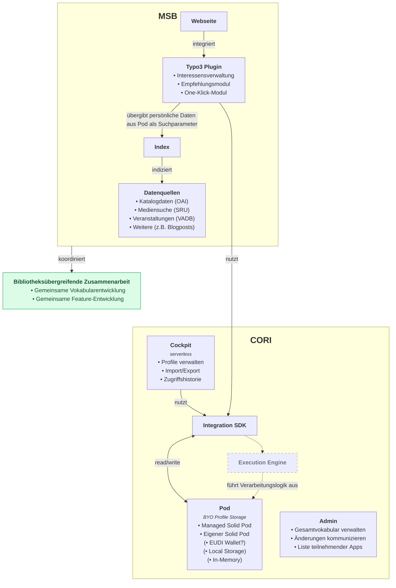

# Bibliotheks-Pods

Bibliotheksnutzer*innen soll es ermöglicht werden persönliche Daten wie ihre Präferenzen und Ausleihhistorie in einem [Solid Pod](https://solidproject.org/) zu verwalten.
Diese persönlichen Daten können für personalisierte Angebote und Empfehlungen genutzt werden, ohne dass die Bibliothek diese Daten selbst speichern muss. 

Die [Webseite der Münchner Stadtbibliothek](https://www.muenchner-stadtbibliothek.de/) basiert auf [typo3](https://opensource.muenchen.de/de/software/typo3.html) und kann mit einem Plug-in erweitert werden.
Nachnutzung durch andere Bibliotheken wird von Anfang an angestrebt.

Das Projekt wird unterstützt durch die Abteilung [Daten und Algorithmen in der Münchner Stadtbibliothek](https://www.muenchner-stadtbibliothek.de/daten-algorithmen) und dem [OSPO](https://opensource.muenchen.de/de/ospo.html).

Auch das Positionspapier [Digitale Souveränität mit Solid, für interoperable und dezentrale Datenökosysteme in der Verwaltung](https://positionspapier-solid-in-der-verwaltung-29ff8c.usercontent.opencode.de/) der Stabsstelle Digitalisierung der Landeshauptstadt Kiel, empfiehlt in seinen Handlungsempfehlungen ''auch die Länder und Kommunen sollten Solid als interoperable Basistechnologie aktiv erproben und in ihre Digitalstrategien integrieren''.

## Architektur

*vorläufig*

## Contributing

Contributions are what make the open source community such an amazing place to learn, inspire, and create. Any contributions you make are **greatly appreciated**.

If you have a suggestion that would make this better, please open an issue with the tag "enhancement", fork the repo and create a pull request. You can also simply open an issue with the tag "enhancement".
Don't forget to give the project a star! Thanks again!

1. Open an issue with the tag "enhancement"
2. Fork the Project
3. Create your Feature Branch (`git checkout -b feature/AmazingFeature`)
4. Commit your Changes (`git commit -m 'Add some AmazingFeature'`)
5. Push to the Branch (`git push origin feature/AmazingFeature`)
6. Open a Pull Request

More about this in the [CODE_OF_CONDUCT](/CODE_OF_CONDUCT.md) file.

## License

Distributed under the MIT License. See [LICENSE](LICENSE) file for more information.

## Contact

it@M - opensource@muenchen.de
