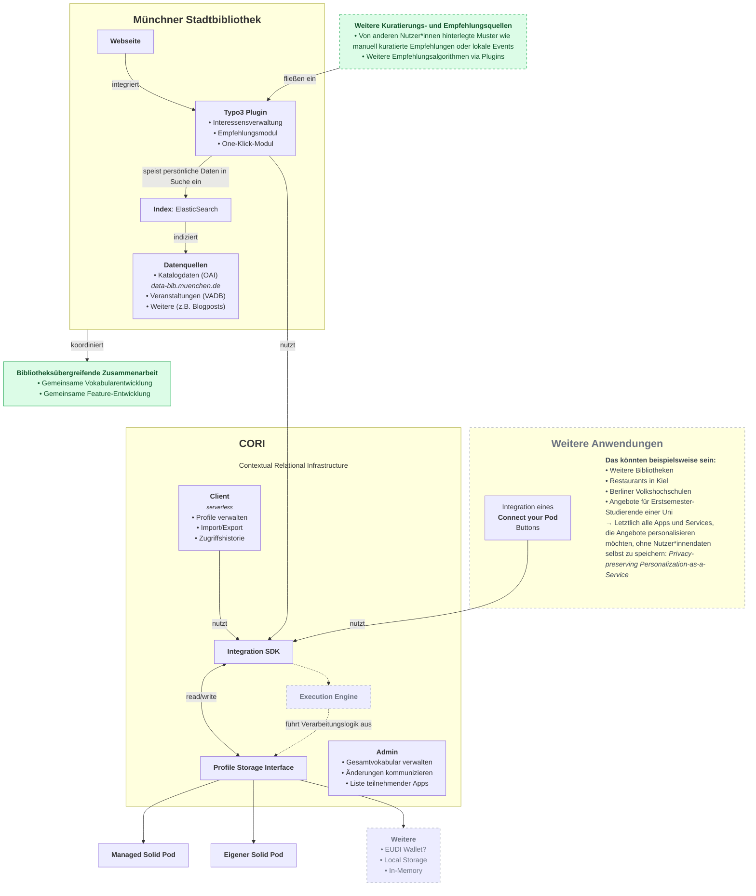

# Bibliotheks-Pods

Bibliotheksnutzer*innen soll es ermöglicht werden persönliche Daten wie ihre Präferenzen und Ausleihhistorie in einem [Solid Pod](https://solidproject.org/) zu verwalten.
Diese persönlichen Daten können für personalisierte Angebote und Empfehlungen genutzt werden, ohne dass die Bibliothek diese Daten selbst speichern muss. 

Die [Webseite der Münchner Stadtbibliothek](https://www.muenchner-stadtbibliothek.de/) basiert auf [typo3](https://opensource.muenchen.de/de/software/typo3.html) und kann mit einem Plug-in erweitert werden.
Nachnutzung durch andere Bibliotheken wird von Anfang an angestrebt.

Das System wird so konzipiert, dass perspektivisch weitere Apps und Services dem Ökosystem beitreten können, um ihre Angebote/Informationen zu personalisieren, ohne selbst Nutzer*innendaten speichern zu müssen.

Das Projekt wird unterstützt durch die Abteilung [Media & Digital bei der Münchner Stadtbibliothek](https://www.muenchner-stadtbibliothek.de/daten-algorithmen) und dem [OSPO](https://opensource.muenchen.de/de/ospo.html).

Auch das Positionspapier [Digitale Souveränität mit Solid, für interoperable und dezentrale Datenökosysteme in der Verwaltung](https://positionspapier-solid-in-der-verwaltung-29ff8c.usercontent.opencode.de/) der Stabsstelle Digitalisierung der Landeshauptstadt Kiel, empfiehlt in seinen Handlungsempfehlungen ''auch die Länder und Kommunen sollten Solid als interoperable Basistechnologie aktiv erproben und in ihre Digitalstrategien integrieren''.

## Architektur

*vorläufig*


```mermaid
flowchart TD
    classDef nonArch fill:#dcfce7,stroke:#16a34a,color:#14532d
    classDef nonArchDashed fill:#dcfce7,stroke:#16a34a,color:#14532d,stroke-dasharray: 5 5
    classDef planned stroke:#9ca3af,color:#6b7280,stroke-dasharray: 5 5
    classDef ghost fill:none,stroke:none,color:#374151
    style moreUseCases stroke:#9ca3af,color:#6b7280,stroke-dasharray: 5 5

    subgraph msb["<h2>Münchner Stadtbibliothek</h2>"]
        data["<b>Datenquellen</b>
            #bull;&nbsp;Katalogdaten (OAI)
                <i>data-bib.muenchen.de</i>
            #bull; Veranstaltungen (VADB)
            #bull; Weitere (z.B. Blogposts)
        "]
        site["<b>Webseite</b>"]
        typo3["<b>Typo3 Plugin</b>
            #bull; Interessensverwaltung
            #bull; Empfehlungsmodul
            #bull; One-Klick-Modul
        "]
        index["<b>Index</b>: ElasticSearch"]
        typo3 -->|speist persönliche Daten in Suche ein| index
        index -->|indiziert| data
        site -->|integriert| typo3
    end

    subgraph moreUseCases["<h2>Weitere Anwendungen</h2>"]
        connectBtn["Integration eines<br><b>Connect your Pod</b><br>Buttons"]
textNode["<div align='left'>
<b>Das könnten beispielsweise sein:</b>
#bull; Weitere Bibliotheken
#bull; Restaurants in Kiel
#bull; Berliner Volkshochschulen
#bull; Angebote für Erstsemester-Studierende einer Uni
→ Letztlich alle Apps und Services, die Angebote personalisieren möchten, ohne Nutzer*innendaten selbst zu speichern: <i>Privacy-preserving Personalization-as-a-Service</i>
<span style='opacity:0'>xxxxxxxxxxxxxxxxxxxxxxxxxxxxxxxx</span>
</div>"]:::ghost
    end

    subgraph cori["<h2>CORI</h2>Contextual Relational Infrastructure"]
        client["<b>Client</b>
            <small><i>serverless</i></small>
            #bull; Profile verwalten
            #bull; Import/Export
            #bull; Zugriffshistorie
        "]
        psi["<b>Profile Storage Interface</b>"]
        admin["<b>Admin</b><br>#bull;&nbsp;Gesamtvokabular&nbsp;verwalten<br>#bull;&nbsp;Änderungen&nbsp;kommunizieren<br>#bull;&nbsp;Liste&nbsp;teilnehmender&nbsp;Apps"]
        exec["<b>Execution Engine</b>"]:::planned
        integrate["<b>Integration SDK</b>"]
        client -->|nutzt| integrate
        integrate <-->|read/write| psi
        integrate -.-> exec
        exec -.->|führt Verarbeitungslogik aus| psi
    end

    bibComm["<b>Bibliotheksübergreifende&nbsp;Zusammenarbeit</b>
        #bull;&nbsp;Gemeinsame&nbsp;Vokabularentwicklung
        #bull;&nbsp;Gemeinsame&nbsp;Feature-Entwicklung
    "]:::nonArch

    pod1["<b>Managed Solid Pod</b>"]
    pod2["<b>Eigener Solid Pod</b>"]
    pod3["<b>Weitere</b>
        #bull; EUDI Wallet?
        #bull; Local Storage
        #bull; In-Memory
    "]:::planned

    communityInput["<b>Weitere Kuratierungs- und Empfehlungsquellen</b>
#bull;&nbsp;Von&nbsp;anderen&nbsp;Nutzer*innen&nbsp;hinterlegte&nbsp;Muster&nbsp;wie manuell&nbsp;kuratierte&nbsp;Empfehlungen&nbsp;oder&nbsp;lokale&nbsp;Events
#bull;&nbsp;Weitere&nbsp;Empfehlungsalgorithmen&nbsp;via&nbsp;Plugins
    "]:::nonArchDashed

    psi --> pod1
    psi --> pod2
    psi --> pod3

    cori ~~~ msb
    msb ~~~ spacer[" "] ~~~ cori
    style spacer fill:none,stroke:none
    typo3 -->|nutzt| integrate
    connectBtn -->|nutzt| integrate
    msb -->|koordiniert| bibComm
    communityInput -->|fließen ein| typo3
```


## Repo-Struktur

- **Bibliotheks-App**: die Funktionalität, mit der Nutzer*innen ihre Profile verwalten und personalisierte Empfehlungen erhalten. Aus einer gemeinsamen Codebasis über drei Auslieferungsziele bereitgestellt: die Demo-Seiten (`docs`), die in die Bibliotheksseite eingebundene TYPO3-Extension (`typo3/bib_pods`) und die HTTP-API (`api`). Aufgeteilt in fünf Schichten (siehe unten).
- **`interim-index/`**: Übergangslösung: ein lokaler Solr-Index aus den OAI-Katalogdaten der Münchner Stadtbibliothek. Enthält den Importer und einen Allowlist-Proxy.
- **`solid-server/`**: lokaler Community Solid Server.

### Die Schichten der Bibliotheks-App

```
  cori-sdk/          ← generic integration SDK source
  bib-src/           ← library-domain source
  docs/              ← assembler #1
  typo3/bib_pods/    ← assembler #2
  api/               ← assembler #3
```

- **`cori-sdk/`**: headless Integration-SDK. Enthält die Storage-Abstraktion mit Backends für lokalen Browser-Speicher und Solid-Pods, das Meta-Vokabular (`UserAction`, `Message`) und RDF-Hilfsfunktionen.
- **`bib-src/`**: bibliotheksspezifische Schicht. Baut auf cori-sdk auf und stellt das Bibliotheks-Pods-Widget (Anmeldung, Benachrichtigungen und – auf der Hauptseite – Speicherortwahl, Profil und Empfehlungen), den Buch-Prompt (Folgefragen beim Klick auf ein Buch), die Buch-Dekoration auf Katalogseiten, die Solr-gestützten Empfehlungen sowie das domänenspezifische Vokabular (`favoriteAuthor`, `RecommendationStrategy`, …) bereit.
- **`docs/`**: arbeitet Aspekte von `bib-src` über GitHub Pages heraus im Sinne einer Dokumentation + Demo + selber experimentieren.
- **`typo3/bib_pods/`**: bündelt `bib-src` zur TYPO3-Extension, die in der lokalen Instanz und auf der Webseite der Münchner Stadtbibliothek eingebunden wird.
- **`api/`**: minimaler HTTP-Server, der `bib-src` headless einbindet: Nutzer*innen senden ihr Profil-Turtle und erhalten Empfehlungen als JSON zurück. Dieselbe Empfehlungslogik wie im Plugin, nur anders ausgeliefert.

### Hilfsskripte

- **`repo.sh {install|build|clean}`**: Sammelaktion über alle npm-Pakete im Repo: `cori-sdk`, `bib-src`, `docs`, `typo3/bib_pods`, `api`, `solid-server`, `interim-index`.
- **`typo3/script.sh {setup|start|stop|flush}`**: lokales TYPO3-Setup via DDEV. `setup` baut eine frische TYPO3-Installation auf, mountet `bib_pods` als Extension und startet Frontend + Backend.
- **`typo3/sync.sh {pull|push|diff}`** — spiegelt `typo3/bib_pods` zu/von einem entfernten SFTP-Pfad (für Deployments auf den TYPO3-Server der Bibliothek). Zugangsdaten kommen aus `.syncdetails` neben dem Skript.

## Contributing

Contributions are what make the open source community such an amazing place to learn, inspire, and create. Any contributions you make are **greatly appreciated**.

If you have a suggestion that would make this better, please open an issue with the tag "enhancement", fork the repo and create a pull request. You can also simply open an issue with the tag "enhancement".
Don't forget to give the project a star! Thanks again!

1. Open an issue with the tag "enhancement"
2. Fork the Project
3. Create your Feature Branch (`git checkout -b feature/AmazingFeature`)
4. Commit your Changes (`git commit -m 'Add some AmazingFeature'`)
5. Push to the Branch (`git push origin feature/AmazingFeature`)
6. Open a Pull Request

More about this in the [CODE_OF_CONDUCT](/CODE_OF_CONDUCT.md) file.


## License

Distributed under the MIT License. See [LICENSE](LICENSE) file for more information.


## Contact

it@M - opensource@muenchen.de
